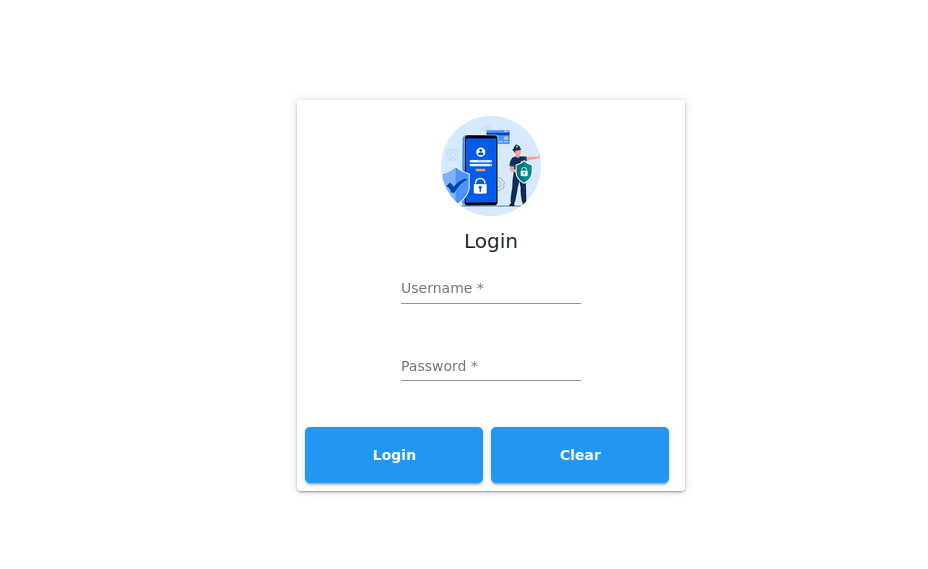

# InventoryManagementBasic

## HOW TO RUN IT

- clone/download the repository
- run command : npm i / npm install
- run command : ng serve

- The back end for loging in is : BE_Login (get the project)
- The main backend for all the other services is :  BE_MyOffice_Springboot (get the project)

- uses git ignore - So it **<u><font color="red">does NOT push the node modules to git</font></u>** 
- The .gitignore file text below

```
node_modules

```

# SCREEN CASTS




## ADD A USER DIRECT TO DB

```sql

INSERT INTO `LoginDB`.`user` (`name`, `password`, `username`) 
VALUES ('Johhny Cage', 'johncage', 'password123');

```

```
"username": "johncage",
"password": "password123"

```

# ATTRIBUTIONS 
- login page ptcture free from : https://www.freepik.com
  - <a href="https://www.freepik.com/free-vector/global-data-security-personal-data-security-cyber-data-security-online-concept-illustration-internet-security-information-privacy-protection_12953630.htm#query=login&position=27&from_view=keyword&track=sph&uuid=c046591d-e9d2-43eb-b121-751229619bd0">Image by jcomp</a> on Freepik